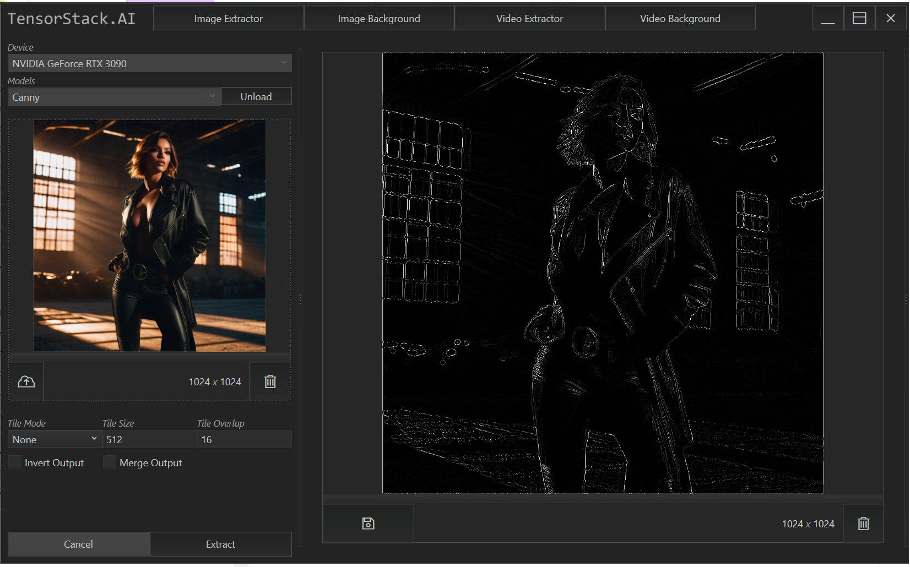
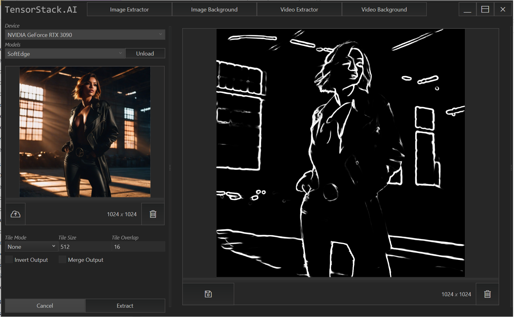
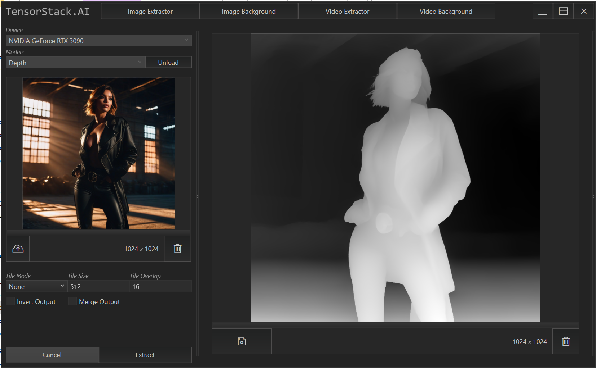
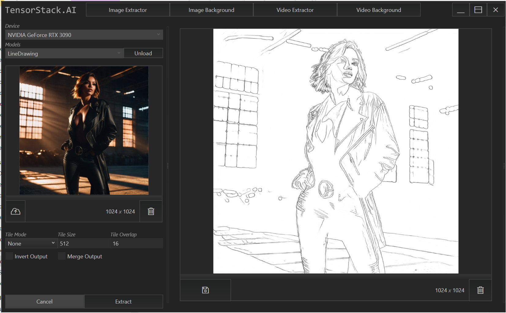
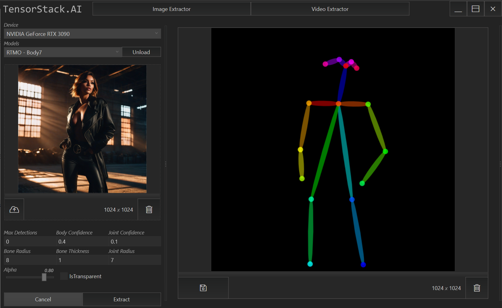
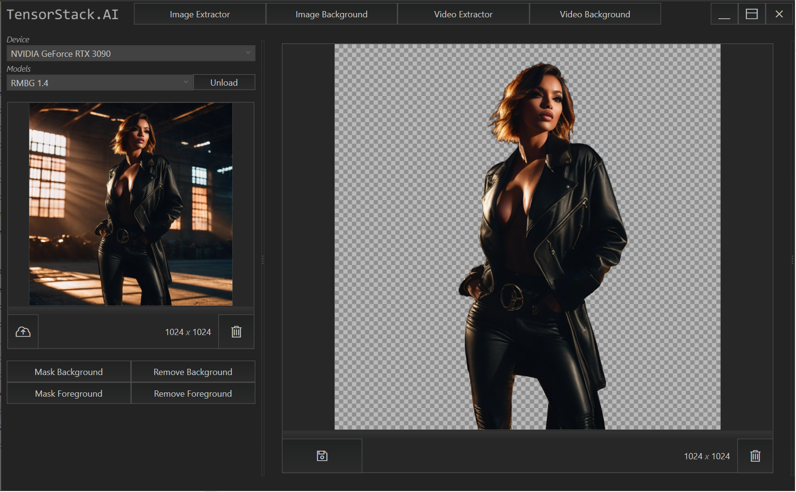
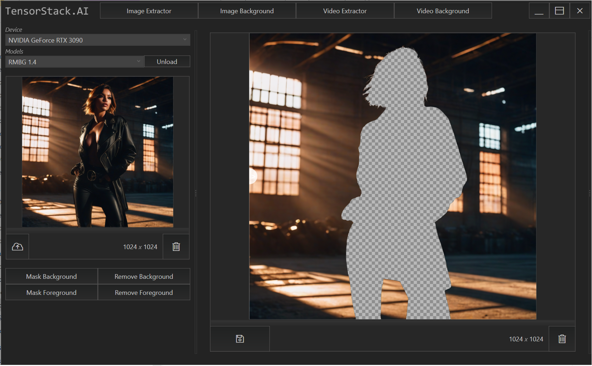
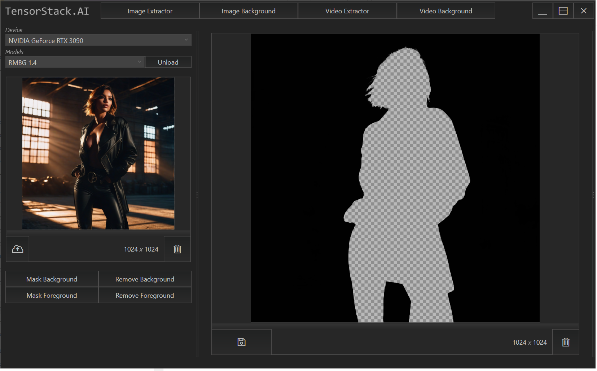
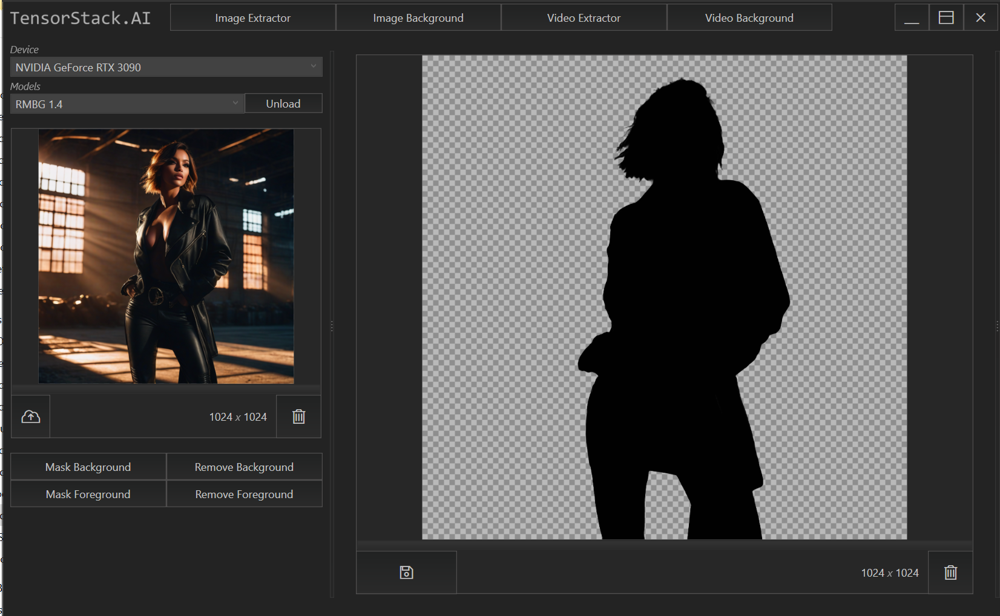

# Extractor Demo
TensorStack Extractor Demo, a simple WPF application showcasing the capabilities of [TensorStack.Extractors](https://github.com/TensorStack-AI/TensorStack/tree/master/TensorStack.Extractors) project.

## Download
[Extractor Demo v0.1.18 (DirectML)](https://github.com/TensorStack-AI/TensorStack/releases/download/v0.1.18/ExtractorDemo_v0.1.18.zip)

## Extractors
Canny Edge

 

Soft Edge

 

Depth Map

 

Line-Drawing

 

OpenPose

 

---

## Background
Remove Background

 

Remove Foreground

 

Mask Background

 

Mask Foreground

 

---

