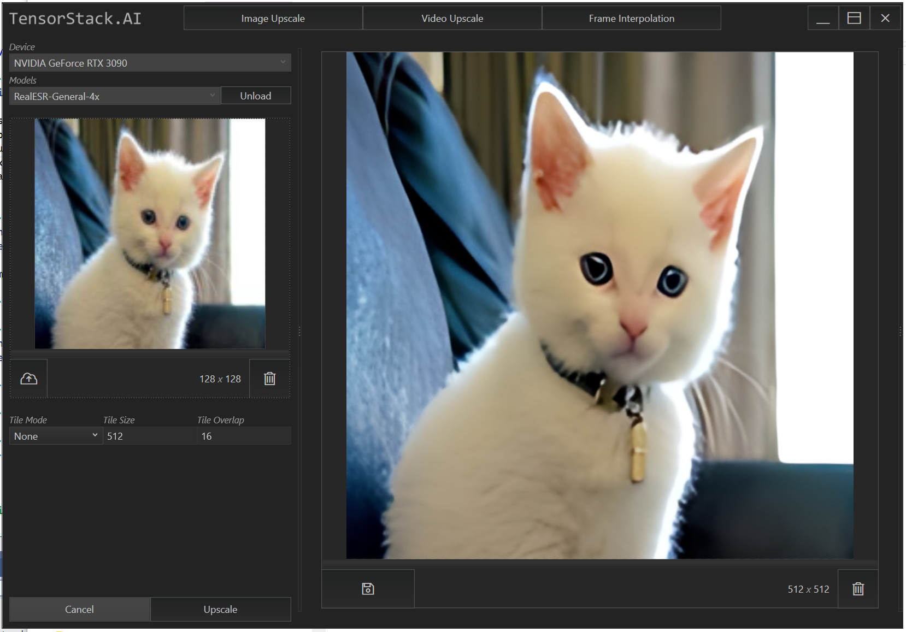
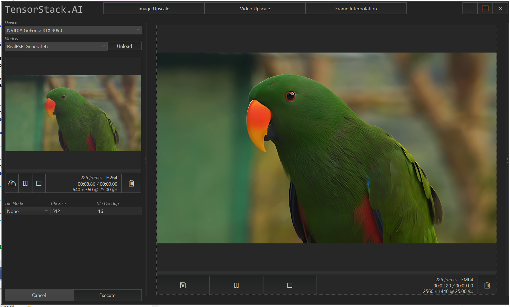
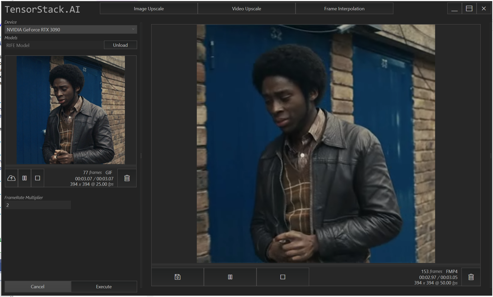

# Upscaler Demo
TensorStack Upscale Demo, a simple WPF application showcasing the capabilities of [TensorStack.Upscaler](https://github.com/TensorStack-AI/TensorStack/tree/master/TensorStack.Upscaler) project.

## Download
[Upscaler Demo v0.1.40 (DirectML)](https://github.com/TensorStack-AI/TensorStack/releases/download/v0.1.39/UpscaleDemo_v0.1.40.zip)

## Upscale Image
 

---

## Upscale Video
 

---

## Video Interpolation
 
